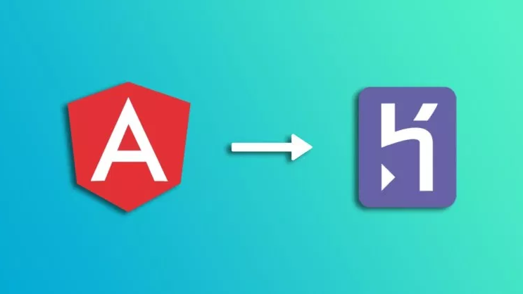

# GetInfo

hello there, welcome on this repository i'm gonna explain how to deploy an <b><i>MEAN API RESTful on Heroku.</b></i>

The current repository is hosted on heroku, so you can find it on this address : <a href="https://hamilton19.herokuapp.com/" target="_blank" > hamilton19.herokuapp</a>

If you are still interested i let you read the chapters below, and i hope you gonna find them helpfull.

good reading !  :notebook:

<ul> <h4>Table of contents</h4>
    <li>  <a href="#c1" target="_blank" >Prerequisite</a> </li>
    <li><a href="#c2" target="_blank" > Create a new App</a> </li>
    <li><a href="#c3" target="_blank" > Deploy on Heroku</a></li>
    <li><a href="#c4" target="_blank" > Provide MongoDB</a></li>
</ul>

 <b>Sources</b>  :point_down: 

<i><a href="https://devcenter.heroku.com/articles/mean-apps-restful-api" target="_blank"> Heroku </a></i>

<i><a href="https://www.codemeals.com/angular/deploy-angular-7-app-to-heroku/" target="_blank"> codeMeals</a></i>

<h2 id="c1"> Prerequisites </h2>

For a good beginning, i will let you know you probably should have some soft skills with MongoDB, Angular, And express.

If you don't have any knowledge about these things, you should practice a little bit with them.  :wink: 

 Well, the first thing we have to do is to ensure we get an recent version of node on our system. 
    For the entire article, i use an Linux Debian operating system, i let you search about the same command for your operating system as well.

 We need a version of node higher at the  8.0.0, i wrote this application under node version 10.16.0, you can install node.js on the website below : 

<a href="https://nodejs.org/en/" target="_blank" > nodejs.org</a>

 Check if you nodejs installation is working by the command : <b><i>node -v </i></b>  You should also have npm installed you can check if is working also by the command : <b><i> npm -v </i></b>

 Now you need to get a verified account on Heroku, register yourself on <a href="https://signup.heroku.com/" target="_blank" > Heroku</a>

 For this tutorial we gonna use the Heroku CLI, you can download it on ubuntu by the command :  <b><i>sudo snap install --classic heroku</i></b>, find all informations you need about the Heroku CLI here : <a href="https://devcenter.heroku.com/articles/heroku-cli" target="_blank">https://devcenter.heroku.com/articles/heroku-cli</a>

 A last thing you need to get is the angular-CLI, you can use this command in your terminal to install angular/cli 
<b><i> npm install -g @angular/cli </i></b>

 Now let's code  :ok_hand: 

<h2 id="c2"> Create a new App </h2>

 With the angular/cli you can create a new project really quickly, use the command below to create a new angular project. 

<code> ng new myAppName </code>

<em> Feel free to replace myAppName by something more original </em>

 Now move into your new directory 

<code> cd myAppName </code>

We need to use Express as a server for our application, install Express with the command below : 

<code>npm install --save express path</code>

 
<em>  :exclamation: Don't forget the flag <b>--save </b> </em>
 

We gonna write some code to verify we have our angular application connected with Express, in first we need to create a file named server.js to write our source code for the server.

In the root of your project type the commanvar distDir = __dirname + "/dist/getInfo";
app.use(express.static(distDir));elow : 

<code>touch server.js</code>

Into this nice empty file, write some code like this for the example.

<code>const express = require('express'); </code> 
<code>const path = require('path'); </code> 
<code>const app = express(); </code> 
<code>app.use(express.static(__dirname + '/dist/MY_APP_NAME_HERE'));</code> 
<code>app.get('/*', function(req, res) {res.sendFile(path.join(__dirname + '/dist/MY_APP_NAME_HERE/index.html'));}); </code> 
<code>app.listen(process.env.PORT || 3000); </code> 
 
<em>  :exclamation: Don't forget to write your own app name</em>
 

In your root directory you should have a file named package.json, edit this file by adding the following code : 

 In the array named scripts, add the following entry : 

<code>"start": "node server.js"</code> 
 
<em>  :exclamation: You probably already get a start entry with " ng serve" replace ng serve by node server.js </em>
 

 At the end of the array named scripts : 

<code>"postinstall": "ng build --aot --prod" </code>

Put inside or create an array "engines" with  your node version and npm version in your package.json file 

<code>"engines": {</code> 
<code>  "node": "~10.16.0",</code> 
<code>  "npm": "~6.4.1" }</code> 

 
<em>  :exclamation: Ensure the node and npm version are equals to your version. </em>
 

 Now type once : 

<code> npm install </code> 

Alrigth, now we can try to see our new App in local browser so open your CLI and move into the root directory and type : 

<code> node server.js </code>

You should see your angular default template on the screen at <a href="http://localhost:3000/" target="_blank">http://localhost:3000/ </a>

<h2 id="c3"> Deploy on Heroku </h2>

To deploy our application on Heroku we just need a few lines of command with the Heroku CLI 

Let's begin with the first one : 

<code> heroku create </code>

 At the end of the order a repository was created for our application and an url address was assigned. Now we want to git init our folder 

<code> git init </code> 
<code> git add . </code> 
<code> git commit -m " First commit " </code> 
<code> git push  https://git.heroku.com/repositoryCreatedByHeroku.git master </code> 
 
<em>  :exclamation: You have to enter the url of the repository created by Heroku from the command <b> Heroku create </b></em>
 

 Once this command is complete, you will see in the terminal that the construction of the site is complete and the address to which it was deployed.

For now you can click on the link provided to see your Angular application hosted 

<h2 id="c4"> Provide MongoDB </h2>

There are several ways to provide a database to our application, we will use the add-on m-lab provided by Heroku. 

To use this type of service it is necessary to inform a credit card to your account Heroku, the installation and the use of m-lab remains free.

Another option is to use <a href="https://www.mongodb.com/cloud/atlas" target="_blank">atlas mongoDB</a>, this being in our tutorial we will continue the installation of a database with the add-on m-lab.

Our fist command is : 

<code>heroku addons:create mongolab --app myAppName </code>

 When you create a mLab add-on, the database connection URI is stored as a config var. 

Heroku config variables are equivalent to an environment variable, which you can use in development and your local environment. You can access this variable in your Node.js code as process.env.MONGODB_URI, which we will use later in our server code.

 Now in your <b> server.js </b> copy/paste the code from here <a href="https://github.com/R3tr093/Angular-getInfo/blob/master/example.js" target="_blank"> https://github.com/R3tr093/Angular-getInfo/blob/master/example.js </a> 

 
<em>  :exclamation: On the line 17 you have to enter the name of your folder, in our example is myAppName.</em>
 

 And add new package into your dependencies with the command below at the root of your directory : 

<code> npm install mongodb express body-parser --save </code>

<code> npm install</code>

 Finally push into the heroku repository : 

<code> git init </code> 
<code> git add . </code> 
<code> git commit -m " First commit " </code> 
<code> git push  https://git.heroku.com/repositoryCreatedByHeroku.git master </code> 

 Type the command below to check if you can get/post the data from your api : 

<code> curl -H "Content-Type: application/json" -d '{"name":"mLab Support", "email": "support@mlab.com"}' http://your-app-name.herokuapp.com/api/contacts </code>
 
<em>  :exclamation: Don't forget to replace the url by the url of your own application.</em>
 

 And this tutorial is over, you can go at <a href="https://your-app-name.herokuapp.com/api/contacts" target="_blank" >https://your-app-name.herokuapp.com/api/contacts</a>

 Thank you for following with me this tutorial  :simple_smile: , feel free to let me a message or a pull request if something wrong. 

